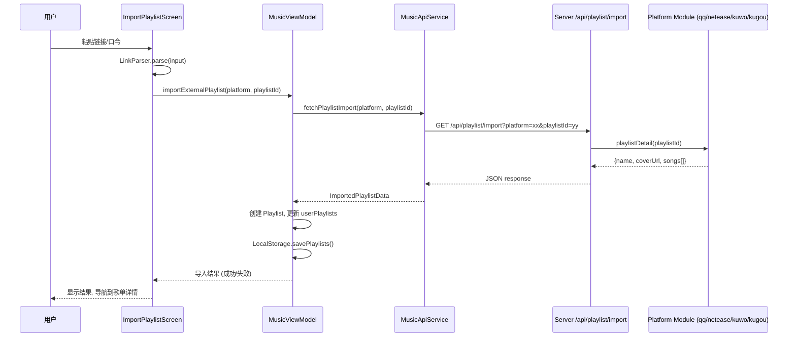

# 设计文档：导入外部歌单

## 概述

本功能为 CloudMusic Android 应用新增"导入外部歌单"能力。整体架构分为客户端（Kotlin/Compose）和服务端（Node.js/Express）两部分：

- **客户端**：新增 `ImportPlaylistScreen` 界面、`LinkParser` 链接解析工具类、ViewModel 中的导入方法
- **服务端**：新增 `/api/playlist/import` 端点，各平台模块新增 `playlistDetail()` 函数

用户在导入界面粘贴歌单链接或分享口令 → 客户端 `LinkParser` 解析出平台和歌单 ID → 调用服务端 API → 服务端从对应平台获取歌单详情 → 客户端创建本地歌单并持久化。

## 架构



## 组件与接口

### 1. LinkParser（客户端工具类）

位置：`com.cloudmusic.app.data.api.LinkParser`

```kotlin
data class ParsedLink(
    val platform: String,   // "QQ音乐" | "网易云" | "酷我音乐" | "酷狗音乐"
    val playlistId: String
)

object LinkParser {
    /**
     * 从用户输入文本中解析歌单链接
     * 支持直接 URL 和分享口令（含短链接的文本）
     * @return ParsedLink 或 null（无法识别时）
     */
    fun parse(input: String): ParsedLink?
}
```

链接匹配规则（正则）：

| 平台 | URL 模式 | 示例 |
|------|---------|------|
| 网易云 | `music\.163\.com/playlist\?id=(\d+)` | `https://music.163.com/playlist?id=123456` |
| 网易云 | `music\.163\.com/#/playlist\?id=(\d+)` | `https://music.163.com/#/playlist?id=123456` |
| 网易云 | `163cn\.tv/([a-zA-Z0-9]+)` | `https://163cn.tv/abc123`（短链接，需服务端解析） |
| QQ音乐 | `y\.qq\.com/n/ryqq/playlist/(\d+)` | `https://y.qq.com/n/ryqq/playlist/123456` |
| QQ音乐 | `i\.y\.qq\.com/n2/m/share/details/taoge\.html\?.*id=(\d+)` | 移动端分享链接 |
| QQ音乐 | `c\.y\.qq\.com/base/fcgi-bin/u\?__=(\w+)` | 短链接 |
| 酷我 | `kuwo\.cn/playlist_detail/(\d+)` | `https://kuwo.cn/playlist_detail/123456` |
| 酷我 | `m\.kuwo\.cn/newh5app/playlist_detail/(\d+)` | 移动端链接 |
| 酷狗 | `kugou\.com/songlist/(\d+)` | `https://www.kugou.com/songlist/123456` |
| 酷狗 | `m\.kugou\.com/.*?listid=(\d+)` | 移动端链接 |

分享口令处理：从文本中用正则 `https?://[^\s]+` 提取 URL，再按上述规则匹配。

### 2. MusicApiService 新增方法（客户端）

```kotlin
// MusicApiService.kt 新增
data class ImportedPlaylistData(
    val name: String,
    val coverUrl: String,
    val songs: List<Song>
)

suspend fun fetchPlaylistImport(platform: String, playlistId: String): ImportedPlaylistData?
```

调用 `serverGet("/api/playlist/import?platform=$platform&playlistId=$playlistId")`，解析返回的 JSON。

### 3. 服务端新增端点

`GET /api/playlist/import?platform=xxx&playlistId=yyy`

响应格式：
```json
{
  "code": 200,
  "data": {
    "name": "歌单名称",
    "coverUrl": "https://...",
    "songs": [
      {
        "id": 1,
        "title": "歌曲名",
        "artist": "歌手",
        "album": "专辑",
        "duration": 240000,
        "coverUrl": "https://...",
        "platform": "网易云",
        "platformId": "12345"
      }
    ]
  }
}
```

错误响应：
```json
{ "code": 404, "error": "歌单不存在或已被删除" }
{ "code": 400, "error": "不支持的平台" }
{ "code": 500, "error": "获取歌单失败: timeout" }
```

### 4. 各平台模块新增 playlistDetail()

每个平台模块（`qq.js`, `netease.js`, `kuwo.js`, `kugou.js`）新增：

```javascript
async function playlistDetail(playlistId) {
  // 返回 { name, coverUrl, songs: [{id, title, artist, album, duration, coverUrl, platform, platformId}] }
}
```

### 5. MusicViewModel 新增方法

```kotlin
// 导入状态
var importState by mutableStateOf<ImportState>(ImportState.Idle)
    private set

sealed class ImportState {
    object Idle : ImportState()
    object Loading : ImportState()
    data class Success(val playlistId: Long, val playlistName: String, val songCount: Int) : ImportState()
    data class Error(val message: String) : ImportState()
}

fun importExternalPlaylist(platform: String, playlistId: String)
fun cancelImport()
fun resetImportState()
```

### 6. ImportPlaylistScreen（Compose UI）

位置：`com.cloudmusic.app.ui.screens.ImportPlaylistScreen`

组件结构：
- 标题栏：标题 + 支持平台副标题
- 使用提示信息
- 输入区域：TextField + 剪贴板粘贴按钮
- 操作按钮：开始导入 + 取消导入
- 导入结果展示（成功/失败）
- 可展开 FAQ 区域

### 7. Screen 路由

```kotlin
// Screen.kt 新增
data object ImportPlaylist : Screen("import_playlist")
```

## 数据模型

### ParsedLink（新增）

```kotlin
data class ParsedLink(
    val platform: String,   // "QQ音乐" | "网易云" | "酷我音乐" | "酷狗音乐"
    val playlistId: String  // 歌单 ID
)
```

### ImportedPlaylistData（新增）

```kotlin
data class ImportedPlaylistData(
    val name: String,       // 歌单名称
    val coverUrl: String,   // 歌单封面
    val songs: List<Song>   // 歌曲列表（复用现有 Song 模型）
)
```

### ImportState（新增）

```kotlin
sealed class ImportState {
    object Idle : ImportState()
    object Loading : ImportState()
    data class Success(
        val playlistId: Long,    // 新创建的本地歌单 ID
        val playlistName: String,
        val songCount: Int
    ) : ImportState()
    data class Error(val message: String) : ImportState()
}
```

### 复用现有模型

- `Song`：歌曲数据，服务端返回的歌曲直接映射到现有 Song 模型
- `Playlist`：本地歌单，导入成功后创建新 Playlist 加入 userPlaylists


## 正确性属性

*正确性属性是一种在系统所有有效执行中都应成立的特征或行为——本质上是关于系统应该做什么的形式化陈述。属性是人类可读规范与机器可验证正确性保证之间的桥梁。*

### Property 1: 链接解析正确性

*For any* 有效的平台歌单 URL（来自 QQ音乐、网易云、酷我音乐、酷狗音乐中的任意一个），无论嵌入在何种文本中，`LinkParser.parse()` 应返回正确的平台名称和歌单 ID。

**Validates: Requirements 1.1, 1.2, 1.3, 1.4, 6.1, 6.2, 6.3, 6.4**

### Property 2: 无效输入拒绝

*For any* 不包含任何受支持平台歌单 URL 的文本字符串，`LinkParser.parse()` 应返回 null。

**Validates: Requirements 1.5**

### Property 3: ParsedLink 序列化往返一致性

*For any* 有效的 `ParsedLink` 对象（platform 为四个支持平台之一，playlistId 为非空数字字符串），序列化为 JSON 后再反序列化应产生等价的对象。

**Validates: Requirements 6.5, 6.6**

### Property 4: 服务端响应解析完整性

*For any* 服务端返回的包含歌曲列表的有效 JSON 响应，客户端解析后每首歌曲应包含 title、artist、album、duration、coverUrl、platform、platformId 所有字段。

**Validates: Requirements 2.2**

### Property 5: 导入创建正确歌单

*For any* 成功的歌单导入操作，新创建的 Playlist 应包含所有导入的歌曲，歌单名称应与原歌单一致，songCount 应等于实际歌曲数量，且 ImportState.Success 中的 songCount 应与歌单中的歌曲数一致。

**Validates: Requirements 3.2, 3.3, 3.4**

### Property 6: 导入持久化往返一致性

*For any* 成功导入的歌单，保存到 LocalStorage 后再加载，应得到包含相同歌曲列表和歌单元数据的等价 Playlist 对象。

**Validates: Requirements 3.5**

## 错误处理

| 错误场景 | 处理方式 | 用户提示 |
|---------|---------|---------|
| 输入文本无法识别链接 | `LinkParser.parse()` 返回 null | "无法识别歌单链接，请检查输入" |
| 不支持的平台 | `LinkParser.parse()` 返回 null | "暂不支持该平台，目前支持：QQ音乐、网易云、酷我音乐、酷狗音乐" |
| 网络请求超时 | OkHttp 超时异常捕获 | "网络请求超时，请检查网络后重试" |
| 服务端返回 404 | 解析 code 字段 | "歌单不存在或已被删除" |
| 服务端返回 500 | 解析 error 字段 | "服务器错误：{error message}" |
| JSON 解析失败 | try-catch JSONException | "数据解析失败，请稍后重试" |
| 歌单歌曲为空 | 检查 songs 列表长度 | "该歌单没有歌曲或歌曲无法获取" |
| 导入过程中用户取消 | 取消 coroutine Job | 静默关闭界面 |

## 测试策略

### 属性测试（Property-Based Testing）

使用 **Kotest** 的 property testing 模块（`io.kotest:kotest-property`）进行属性测试。

每个属性测试至少运行 **100 次迭代**，使用随机生成的输入数据。

每个正确性属性对应一个独立的属性测试，测试注释格式：
```
// Feature: import-external-playlist, Property N: {property_text}
```

属性测试覆盖：
- Property 1: 生成随机平台 URL 嵌入随机文本，验证解析结果
- Property 2: 生成不含有效 URL 的随机字符串，验证返回 null
- Property 3: 生成随机 ParsedLink，序列化后反序列化验证等价
- Property 4: 生成随机 JSON 响应，验证解析后字段完整
- Property 5: 模拟导入流程，验证 Playlist 内容正确
- Property 6: 创建随机 Playlist，保存后加载验证等价

### 单元测试

单元测试聚焦于具体示例和边界情况：

- LinkParser 各平台具体 URL 示例测试
- LinkParser 分享口令文本提取测试
- 空输入、纯空白输入的边界测试
- 服务端错误响应（404、500）的处理测试
- ImportState 状态转换测试
- 服务端 playlistDetail() 各平台的集成测试
